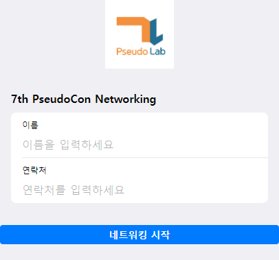

# PseudoLab Networking Application Project

네트워킹 주제 랜덤 픽  
네트워킹 빙고  

네트워킹 자동 매칭  
실시간 채팅  
메타버스(?)  

# Tech Stack

## frontend
svelte + svelte-kit

## backend

### API
python  
fastapi  
mongodb-atlas (Free Cloud)
EC2 or Oracle Cloud

### RealTime Server
WebSocket  
fastapi?? Rust??

## Database 접속정보
Discord 채널에서 문의

## 개발 이슈

### API Server Windows Mongo DB Connection 문제
1. https://letsencrypt.org/certs/lets-encrypt-r3.pem 다운로드  
2. .pem -> .cer 이름 변경
3. 더블클릭하여 인증서 등록